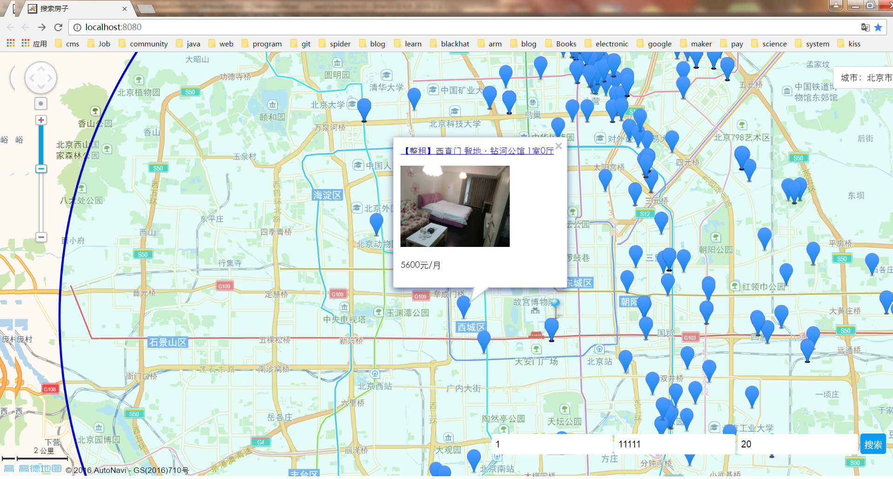

# 58 租房搜索
----------------------------

在实验楼看到一个很有趣的项目：[高德API+Python解决租房问题](https://www.shiyanlou.com/courses/599/labs/1978/document)
决定按照自己掌握的技术实现一遍，

### 思路
-----------------
从58同城抓取租房信息，持久化的存储在数据库里面，然后在网页里调用高德的API，创建一个电子地图，当用户选择一个地点，并且输入房租价位与搜索半径后，在数据里搜索符合条件的记录，然后组织成一个个的高德标记。

### preview
--------------------

### 测试网址
------------------------

[58 house map](http://118.25.212.166/58HouseMap/)

ps:目前只支持北京地区的房源

#### Unresolved
* 多个公寓位置重合,公寓定位数据不准。
* 两个爬虫，完善对于房源的及时更新与清理功能
* 扩大房源，不要局限于58
* 通勤功能，有限推荐上班方便的公寓
* ~~使用数据库配置文件，检查连接是否失效，保持长连接~~
* ~~完善展示的信息~~
* ~~优化js加载的资源,优化传输的json~~
* ~~重新点击的时候，销毁信息窗体~~
* ~~调整二维码的位置~~
* ~~自适应屏幕尺寸~~
* ~~使用了数据库连接池去支持程序调用~~
